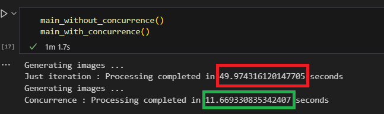

# Applying parallel computing in image processing



## 📋 Description

This repository aims to show in a simple way how the use of parallel programming can help in image processing in computer vision systems.

The dataset used contains more than 4000 images of cats and dogs, the objective is just to apply a gray scale to all images for training and future applications.

## 🚀 Features

- Apply gray scale with opencv for image processing
- Execute parallel and concurrency programming techniques
- Comparison of processing times

## 🛠️ Technologies Used

- **Python** (base language)
- **ThreadPoolExecutor** (responsable for otimize the processing)
- **Threading** (For processing more fast)
- **Jupyter Notebook** (for divide the program in cells)

## 📦 Installation

### Requirements

- Python 3.x
- OpenCV
- ThreadPoolExecutor

### Installation Steps

1. Clone the repository:
    ```bash
    git clone https://github.com/IsaacMartins12/Threads-image-processing
    ```

2. Install dependencies:
    ```bash
    pip install opencv-python 
    ```

3. Run the main application acessing jupyter notebook


## 🧑‍💻 Contribution

Feel free to submit pull requests or report issues on the [Issues page](https://github.com/IsaacMartins12/Threads-image-processing/issues).

1. Fork the project.
2. Create a branch for the new feature (`git checkout -b feature/new-feature`).
3. Commit your changes (`git commit -am 'Add new feature'`).
4. Push to the branch (`git push origin feature/new-feature`).
5. Create a new Pull Request.

## 📜 License

This project is licensed under the [MIT License](LICENSE).
